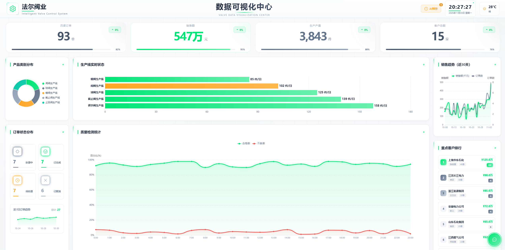

# 🎯 智能阀门控制系统 - 数据可视化中心

[](https://vuejs.org/)
[](https://www.typescriptlang.org/)
[](https://echarts.apache.org/)
[](https://www.deepseek.com/)
[](LICENSE)

> 江苏盐城大丰法尔阀门集团企业级智能数据可视化大屏系统  
> **浅色背景 + 荧光绿点缀 + AI智能分析**



---

## ✨ 核心亮点

### 🎨 现代化设计风格
- 📱 **简约浅色主题** - 专业、大气、商务风格
- 💚 **荧光绿点缀** - 关键数据高亮，科技感十足
- 🎯 **科技线条装饰** - 精致的边框与分隔线
- ✨ **微光效果** - 悬浮卡片、关键指标的细微光晕
- 🔄 **平滑动画** - 数据更新、页面过渡流畅自然

### 🤖 AI智能功能（全新）
- 🚨 **智能异常预警** - 自动检测数据异常，AI深度分析原因和建议
- 💬 **对话式查询** - ChatGPT风格，自然语言问答业务数据
- 🔍 **DeepSeek驱动** - 强大的AI推理能力
- ⚡ **按需调用** - 节省Token，仅在主动触发时调用API

### 📊 全面的数据展示
- 📈 **实时生产监控** - 5条生产线状态实时追踪
- 📉 **质量趋势分析** - 合格率、不良率可视化
- 💰 **销售数据洞察** - 30天趋势、重点客户排行
- 📦 **订单状态追踪** - 7天订单趋势，状态分布
- 🎯 **关键指标概览** - 月度订单、销售额、产量、客户数

---

## 🖼️ 界面预览

### 主仪表盘


### AI智能功能
| 智能异常预警 | 对话式数据查询 |
|------------|--------------|
| 📊 自动检测异常 | 💬 自然语言提问 |
| 🤖 AI深度分析 | 📈 智能数据洞察 |
| 💡 应对方案建议 | ⚡ 快速提问模板 |

---

## 🚀 快速开始

### 环境要求
- Node.js >= 18.x
- npm >= 9.x

### 安装依赖
```bash
npm install
```

### 开发运行
```bash
npm run dev
```
访问：http://localhost:5173

### 生产构建
```bash
npm run build
```

### 预览构建结果
```bash
npm run preview
```

---

## 🏗️ 项目结构

```
valve_digital_twin_dashboard/
├── src/
│   ├── components/
│   │   ├── AI/                    # 🤖 AI功能模块（新）
│   │   │   ├── AIWarningPanel.vue      # 智能预警面板
│   │   │   └── AIChatAssistant.vue     # AI对话助手
│   │   ├── HeaderBar/             # 顶部导航栏
│   │   ├── DataOverview/          # 数据概览（4个关键指标）
│   │   ├── LeftPanel/             # 左侧面板
│   │   │   ├── ProductDisplay.vue      # 产品类别分布
│   │   │   └── OrderStatistics.vue     # 订单状态统计
│   │   ├── CenterPanel/           # 中央核心区域⭐
│   │   │   ├── ProductionChart.vue     # 生产线实时状态
│   │   │   └── QualityChart.vue        # 质量检测统计
│   │   └── RightPanel/            # 右侧面板
│   │       ├── SalesTrend.vue          # 销售趋势
│   │       └── TopCustomers.vue        # 重点客户排行
│   ├── services/
│   │   └── aiService.ts           # 🤖 AI服务封装（DeepSeek）
│   ├── stores/
│   │   └── business.ts            # 业务数据状态管理
│   ├── styles/
│   │   ├── variables.scss         # 设计系统变量
│   │   └── common.scss            # 全局样式
│   └── views/
│       └── Dashboard/             # 主页面
├── AI_FEATURES_README.md          # 📖 AI功能详细文档
└── package.json
```

---

## 🎨 设计系统

### 配色方案

#### 主色调（浅色系）
```scss
$bg-primary: #F8FAFC;              // 主背景 - 浅灰白
$bg-secondary: #F1F5F9;            // 次背景 - 稍深灰白
$card-bg: rgba(255, 255, 255, 0.95); // 卡片背景 - 半透明白
```

#### 荧光绿点缀（关键指标）
```scss
$neon-green: #00E676;              // 荧光绿 - 主要强调色
$neon-green-light: #69F0AE;        // 浅荧光绿 - 渐变/悬浮
$neon-green-dark: #00C853;         // 深荧光绿 - 深色模式
```

#### 中性色系（常规数据）
```scss
$primary-color: #475569;           // 主文字色 - 深灰蓝
$text-primary: #1E293B;            // 一级文字 - 墨蓝
$text-secondary: #64748B;          // 二级文字 - 中灰蓝
$text-tertiary: #94A3B8;           // 三级文字 - 浅灰蓝
```

#### 语义色
```scss
$success-color: #00E676;           // 成功 - 荧光绿
$warning-color: #FFA726;           // 警告 - 橙色
$danger-color: #EF5350;            // 危险 - 红色
$info-color: #64748B;              // 信息 - 灰蓝
```

### 视觉特效

#### 荧光绿光晕
```scss
$glow-neon: 0 0 12px rgba(0, 230, 118, 0.6);           // 强光晕
$glow-neon-subtle: 0 0 8px rgba(0, 230, 118, 0.3);    // 弱光晕
```

#### 卡片阴影
```scss
$card-shadow: 0 2px 12px rgba(0, 0, 0, 0.04);         // 常规阴影
$glow-card: 0 4px 20px rgba(0, 0, 0, 0.05);           // 悬浮阴影
```

### 科技装饰线条
- 卡片顶部细线（荧光绿）
- Logo四角装饰线
- Header底部中心线条
- 标题左侧竖线

---

## 🤖 AI功能详解

### 1️⃣ 智能异常预警（AIWarningPanel）

**位置**：HeaderBar 右侧，时间旁边

**功能特性**：
- 🔍 自动检测4类异常（质量、生产、订单、销售）
- ⏰ 每5分钟自动扫描
- 📊 风险等级分级（高/中/低）
- 🤖 DeepSeek AI深度分析
- 💡 原因诊断 + 应对建议
- ✅ 异常标记处理

**使用流程**：
```
1. 系统自动检测异常
2. 显示橙色徽章数字
3. 点击"AI预警"查看列表
4. 点击"AI深度分析"
5. 等待2-3秒获得AI分析
6. 查看原因和建议
```

**检测规则**：
- 质量合格率 < 90%
- 生产效率低于标准15%
- 订单待处理数量过多
- 销售额异常波动

### 2️⃣ 对话式数据查询（AIChatAssistant）

**位置**：右下角荧光绿浮动按钮

**功能特性**：
- 💬 ChatGPT风格对话界面
- 🗣️ 自然语言提问
- 📊 基于实时业务数据回答
- ⚡ 快速提问模板
- 🔄 支持多轮对话（保留最近3轮）
- 📝 Markdown格式回复
- 🔍 可切换全屏模式（600x750 ↔ 90vw x 90vh）

**快速提问示例**：
```
✅ "今天销售情况如何？"
✅ "哪条生产线效率最低？"
✅ "订单完成率是多少？"
✅ "帮我分析一下重点客户"
✅ "质量检测有什么问题吗？"
```

**对话界面优化**：
- 默认大窗口：600px × 750px
- 全屏模式：1400px × 900px（最大）
- 字体放大：15px，行高1.7
- 更大间距：消息间距20px

### Token优化策略

为节省API调用成本：
- ✅ **被动触发** - 只在用户点击时调用
- ✅ **历史限制** - 仅保留最近3轮对话
- ✅ **数据精简** - 只传必要的业务数据
- ✅ **结果缓存** - 避免重复分析

预估消耗：
- 单次异常分析：~500 tokens
- 单次对话查询：~800 tokens

### API配置

**DeepSeek API Key**（已配置）：
```typescript
// src/services/aiService.ts
const DEEPSEEK_API_KEY = 'sk-a9eb1809c54c416e96f31c4e3a1955e3'
```

**生产环境建议**：
```bash
# .env.local
VITE_DEEPSEEK_API_KEY=your_api_key_here
```

---

## 📊 核心功能模块

### 顶部 - 数据概览
```
┌──────────┬──────────┬──────────┬──────────┐
│ 月度订单 │ 销售额   │ 生产产量 │ 客户总数 │
│  686单   │ 9,279元  │ 580件    │ 1,623家  │
│  ↑12.5%  │ ↑18.5%   │ ↑15.2%   │ ↑8.3%    │
└──────────┴──────────┴──────────┴──────────┘
```
- 荧光绿增长徽章
- 进度条指示
- 数字滚动动画

### 左侧面板

**1. 产品类别分布**（环形图）
- 8种产品类型
- 荧光绿主色调 + 中性色搭配
- 悬浮提示详情

**2. 订单状态分布**（4宫格 + 趋势图）
- 已完成、处理中、待处理、已取消
- 各状态进度条
- 7天订单趋势小图（新增）

### 中间核心区域⭐

**1. 生产线实时状态**（横向柱状图）
- 5条生产线（闸阀、球阀、蝶阀、截止阀、止回阀）
- 运行中（荧光绿）/ 维护中（橙色）
- 发光阴影效果
- 自动更新（每10秒）

**2. 质量检测统计**（双折线图）
- 合格率趋势（荧光绿）
- 不良率趋势（红色）
- 区域渐变填充
- 实时数据更新

### 右侧面板

**1. 销售趋势**（30天双线图）
- 销售额曲线（荧光绿）
- 订单数曲线（中性灰蓝）
- 平滑曲线动画

**2. 重点客户排行**（TOP10）
- 第1名荧光绿徽章
- 第2-3名灰蓝徽章
- VIP/A/B等级标签
- 悬浮发光效果
- 可滚动查看

---

## 🎬 动态效果

### 背景动画
- 🌊 **网格流动** - 60x60网格，50秒循环
- 🔮 **光球漂浮** - 荧光绿/灰蓝光球，30秒循环
- 📊 **数据滚动** - CountUp.js数字动画

### 交互反馈
- ✨ **卡片悬浮** - 上浮4px + 阴影增强
- 💚 **荧光线显现** - 装饰线条高亮
- 🔄 **平滑过渡** - 0.3s cubic-bezier缓动
- 📈 **图表动画** - 数据更新平滑过渡

### Header特效
- 🌟 **扫描线** - 5秒横向扫过
- 💚 **脉冲点** - 荧光绿呼吸动画（2s）
- 🎯 **科技线条** - 底部中心装饰

---

## 🛠️ 技术栈

### 核心框架
| 技术 | 版本 | 用途 |
|------|------|------|
| Vue 3 | ^3.4.21 | 渐进式框架，组合式API |
| TypeScript | ^5.4.0 | 类型安全 |
| Vite | ^5.2.0 | 构建工具 |
| Pinia | ^2.1.7 | 状态管理 |

### 可视化 & UI
| 技术 | 版本 | 用途 |
|------|------|------|
| ECharts | ^5.5.0 | 数据可视化图表 |
| Element Plus | ^2.7.0 | UI组件库 |
| SCSS | - | 样式预处理 |
| CountUp.js | ^2.8.0 | 数字滚动动画 |

### AI功能
| 技术 | 版本 | 用途 |
|------|------|------|
| OpenAI SDK | ^4.77.3 | DeepSeek API调用 |
| Axios | ^1.7.2 | HTTP客户端 |

### 开发工具
- ESLint - 代码规范
- Prettier - 代码格式化
- Vue Devtools - 调试工具

---

## ⚙️ 配置与定制

### 修改公司信息
```vue
<!-- src/components/HeaderBar/index.vue -->
<h1 class="company-name">智能阀门控制系统</h1>
<p class="company-location">Intelligent Valve Control System</p>
<div class="title-main">数据可视化中心</div>
```

### 调整数据刷新频率
```typescript
// src/views/Dashboard/index.vue
useDataRefresh(10000) // 10秒，可修改为5000、15000等
```

### 修改主题色
```scss
// src/styles/variables.scss
$neon-green: #YOUR_COLOR;        // 改为你的品牌色
$neon-green-light: #YOUR_LIGHT;  // 浅色版本
```

### 配置AI API
```typescript
// src/services/aiService.ts
const DEEPSEEK_API_KEY = 'your-api-key-here'
```

### 对接真实数据
```typescript
// src/api/business.ts
export function getProducts() {
  // 替换为你的真实API
  return axios.get('https://your-api.com/products')
}
```

---

## 📦 部署指南

### 静态部署（推荐）
```bash
# 1. 构建
npm run build

# 2. dist目录上传到服务器
# Nginx配置示例：
server {
    listen 80;
    server_name your-domain.com;
    root /var/www/valve-dashboard/dist;
    index index.html;
    
    location / {
        try_files $uri $uri/ /index.html;
    }
}
```

### Vercel部署
```bash
npm install -g vercel
vercel --prod
```

### Docker部署
```dockerfile
FROM nginx:alpine
COPY dist /usr/share/nginx/html
EXPOSE 80
CMD ["nginx", "-g", "daemon off;"]
```

---

## 🎯 使用场景

### 推荐场景
- ✅ 企业展厅大屏展示
- ✅ 生产车间监控中心
- ✅ 管理层数据驾驶舱
- ✅ 客户参观演示
- ✅ 展会展览
- ✅ 远程监控中心

### 硬件建议
| 项目 | 推荐配置 |
|------|---------|
| 屏幕尺寸 | ≥ 55寸 |
| 分辨率 | 1920x1080 或更高 |
| 浏览器 | Chrome/Edge 最新版 |
| 显卡 | 支持硬件加速 |
| 内存 | ≥ 8GB |

---

## 🔧 性能优化

### 已实施优化
- ✅ ECharts按需引入
- ✅ 组件懒加载
- ✅ 图表响应式resize
- ✅ 防抖节流处理
- ✅ CSS硬件加速（transform、opacity）
- ✅ 动画性能优化（will-change）
- ✅ 虚拟滚动（长列表）
- ✅ 图片懒加载

### 性能指标
- 首屏加载：< 2s
- FPS：稳定60fps
- 内存占用：< 100MB
- 数据更新：< 100ms

---

## 💡 使用技巧

### 1. 全屏模式
```
按 F11 进入浏览器全屏
获得最佳展示效果
```

### 2. AI助手全屏
```
点击右下角荧光绿按钮
点击对话框左上角全屏图标
窗口放大到 1400x900px
```

### 3. 性能监控
```
打开 Chrome DevTools (F12)
Performance 选项卡
记录性能快照
```

### 4. 数据导出
```
右键点击图表
选择 "保存为图片"
或使用 ECharts 工具栏
```

---

## 📖 相关文档

- [AI功能详细文档](./AI_FEATURES_README.md) - AI预警和对话助手使用指南
- [项目总结文档](./PROJECT_SUMMARY.md) - 开发历程和技术决策
- [更新日志](./CHANGELOG.md) - 版本更新记录

---

## 🐛 常见问题

### Q: AI功能不工作？
**A**: 检查以下几点：
1. API Key是否正确配置
2. 网络是否可以访问DeepSeek API
3. 浏览器控制台是否有错误
4. 查看 `src/services/aiService.ts` 配置

### Q: 图表不显示？
**A**: 确保：
1. ECharts正确安装：`npm list echarts`
2. 窗口resize后图表自动适配
3. 检查浏览器控制台错误

### Q: 数据不更新？
**A**: 检查：
1. `useDataRefresh` hook是否启用
2. 定时器是否正常运行
3. API接口是否返回数据

### Q: 性能卡顿？
**A**: 优化方案：
1. 减少数据刷新频率
2. 降低动画复杂度
3. 禁用部分背景动画
4. 启用浏览器硬件加速

---

## 🤝 贡献指南

欢迎贡献代码、报告问题或提出建议！

1. Fork 本仓库
2. 创建特性分支：`git checkout -b feature/AmazingFeature`
3. 提交更改：`git commit -m 'Add some AmazingFeature'`
4. 推送到分支：`git push origin feature/AmazingFeature`
5. 提交 Pull Request

---

## 📄 许可证

本项目采用 MIT 许可证 - 详见 [LICENSE](LICENSE) 文件

---

## 👥 开发团队

**公司**: 江苏盐城大丰法尔阀门集团  
**系统**: 智能阀门控制系统 - 数据可视化中心  
**版本**: 4.0.0（AI智能版）  
**更新**: 2025-11-03  

---

## 🌟 Star History

如果这个项目对你有帮助，请给一个 ⭐️ Star！

---

<div align="center">

**Made with ❤️ by Valve Digital Twin Team**

[🏠 首页](#-智能阀门控制系统---数据可视化中心) · [🚀 快速开始](#-快速开始) · [🤖 AI功能](#-ai功能详解) · [📖 文档](#-相关文档)

</div>
